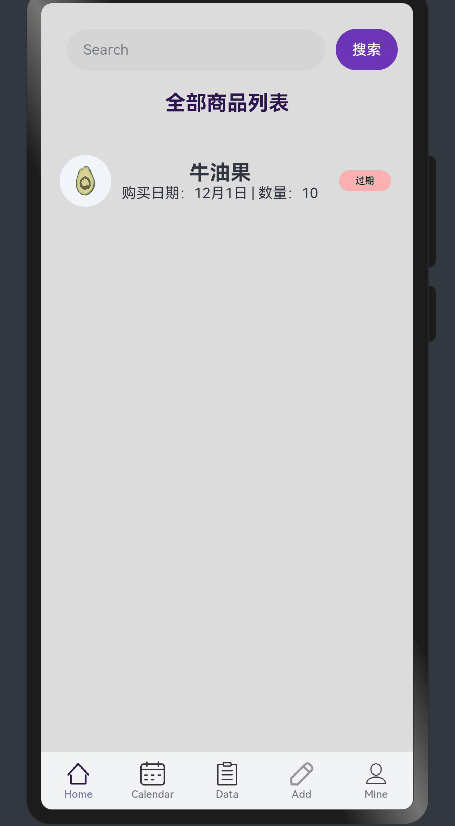

[鸿蒙官方的CodeLabs]('https://developer.harmonyos.com/cn/documentation/codelabs/?catalogVersion=V3')

### ArkTs项目初探

#### 介绍
鸿蒙HarmonyOS的第一个demo项目

参考教程：
https://juejin.cn/column/7302344199445659686，可以直接订阅专栏

